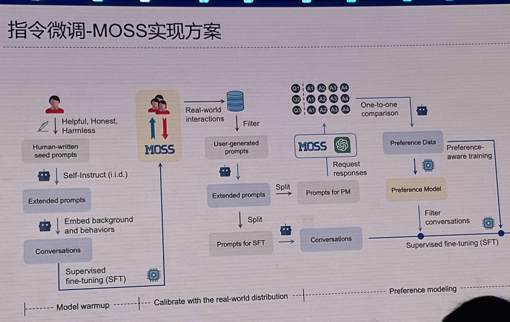

# 🧠 Awesome-Chinese-ChatGPT-Implement
收录实现中文版ChatGPT的各种开源技术路线，数据及其他资料

 

Three steps to ChatGPT: 
1. LLM-pretrain
2. Instruction tuning and code continual pretrain
3. RLHF (SFT, RM, PPO-RL)

具体技术可参考 [dalinvip/Awesome-ChatGPT](https://github.com/dalinvip/Awesome-ChatGPT)

## Data

- [BELLE指令微调数据集](https://github.com/LianjiaTech/BELLE/tree/main/1.5M)(1.5M)
- [BELLE10M中文数据集](https://github.com/LianjiaTech/BELLE/tree/main/10M), 包含0.25M数学指令数据集和0.8M多轮任务对话数据集
- [InstructionWild](https://github.com/XueFuzhao/InstructionWild): Colossal AI 收集的中英双语数据集(104K)
- [GPT-4-LLM](https://github.com/Instruction-Tuning-with-GPT-4/GPT-4-LLM): GPT-4标注的中英双语指令微调数据，prompt来自[Stanford Alpaca](https://github.com/tatsu-lab/stanford_alpaca)。
- [ShareGPT](https://sharegpt.com/): ChatGPT用户分享的聊天数据，大部分为英文数据，插件维护者目前已经关闭了公开获取数据的接口。
- [CAMEL](https://github.com/lightaime/camel#data-hosted-on-hugging-face): 对话式指令跟随数据集，并将英文数据翻译到10种包含中文的不同语言。

## 模型

### [BELLE](https://github.com/LianjiaTech/BELLE)

参照[Stanford Alpaca](https://github.com/tatsu-lab/stanford_alpaca)(SFT only)，对BLOOMZ和LLAMA进行微调。

### [MOSS](https://github.com/txsun1997/MOSS)
<!--  -->

复旦大学团队研发的实现方案，图来自邱老师的分享。(Backbone为20B大模型)

### [ChatGLM-6B](https://github.com/THUDM/ChatGLM-6B)

清华大学团队基于[GLM](https://github.com/THUDM/GLM)的实现方案，其6B模型已公布权重。

### [ColossalChat](https://github.com/hpcaitech/ColossalAI/tree/main/applications/Chat)
Colossal-AI实现RLHF for LLM方案(基于LLaMA)。

### [DeepSpeed Chat](https://github.com/microsoft/DeepSpeed/tree/master/blogs/deepspeed-chat)
微软基于DeepSpeed开源的简单、快速且经济实惠的RLHF训练方案。

## LLM(基座)
### LLaMA
[LLaMA](https://github.com/facebookresearch/llama): Open and Efficient Foundation Language Models，Facebook/Meta开源的LLM，中文词表较小。

### BLOOM
Huggingface开源的LLM模型。
- [BLOOM](https://huggingface.co/docs/transformers/v4.27.2/en/model_doc/bloom#overview)
- [BLOOMZ](https://huggingface.co/bigscience/bloomz): 指令微调版的BLOOM

### GLM
清华大学开源的使用自回归填空目标进行预训练的通用语言模型[GLM](https://github.com/THUDM/GLM)

## 其他相关开源项目
其余优秀开源项目，大部分为纯英文

- [Stanford Alpaca](https://github.com/tatsu-lab/stanford_alpaca): LLAMA-7B SFT
- [Vicuna](https://github.com/lm-sys/FastChat): LLAMA-7b&13B SFT，数据来自ShareGPT
- [Baize](https://github.com/project-baize/baize-chatbot): LLAMA聊天微调，数据采集自ChatGPT self-chat
- [LoRA](https://github.com/microsoft/LoRA): popular低成本LLM参数高效微调方案，已集成到[PEFT](https://github.com/huggingface/peft)
- [self-instruct](https://github.com/yizhongw/self-instruct): 低成本收集指令微调数据
- [UltraChat](https://github.com/thunlp/UltraChat): ChatGPT生成的多轮对话数据集，目前只包含英文。
- [Dolly](https://github.com/databrickslabs/dolly): 基于EleutherAI/pythia-12b的指令微调，包含首个开源的人工标注指令微调数据集。

## Contribution
如果你创建或发现了任何关于实现中文ChatGPT的优秀资源，请创建Issue或PR来贡献这个仓库!

If you created or found any awesome resource about Chinese ChatGPT, feel free to create issues or PRs to contribute to this repository!
